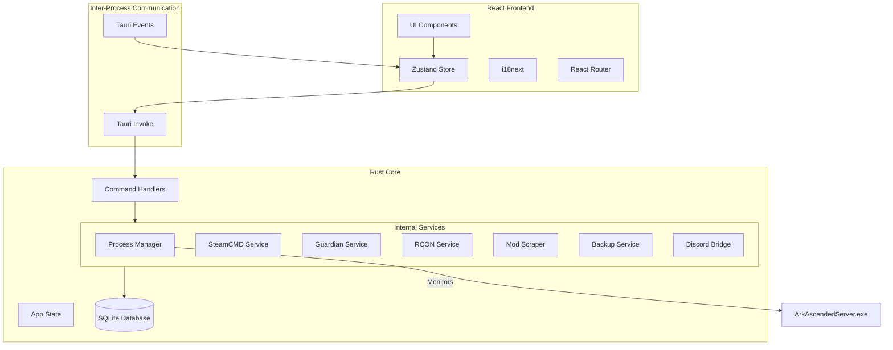

# ARK: Survival Ascended Server Manager 2.0 - System Architecture

This document outlines the high-level architecture, design patterns, and technical stack of the ARK: Survival Ascended Server Manager 2.0.

## 1. Overview

The application is a desktop management suite designed to automate the deployment, configuration, and maintenance of ARK: Survival Ascended (ASA) servers. It is built using a bifurcated architecture:
- **Core (Tauri)**: A high-performance Rust backend for systems-level operations.
- **Frontend (React)**: A modern, responsive UI for user interaction.

## 2. Technology Stack

| Layer | Technology |
| :--- | :--- |
| **Framework** | [Tauri v2](https://tauri.app/) |
| **Backend** | Rust |
| **Frontend** | React 19 + TypeScript |
| **Styling** | Tailwind CSS + Framer Motion |
| **State Management** | Zustand |
| **Database** | SQLite (Better-SQLite3 / Rusqlite) |
| **Communication** | Tauri IPC (Invoke/Events) |

## 3. High-Level Architecture

## 4. Backend Services (Rust)

The backend is composed of specialized services managed by the `AppState`:

- **Process Manager**: Handles the lifecycle of the ASA server executable, including startup arguments and process affinity.
- **Guardian Service**: An autonomous watchdog that detects crashes or hangs and triggers auto-restarts.
- **RCON Service**: Implements the Source RCON protocol to communicate with active servers for administration and cross-chat.
- **SteamCMD Service**: Manages the installation and verification of the server binaries.
- **Discord Bridge**: Provides a real-time link between in-game chat/status and Discord channels.
- **Mod Watchdog**: Monitors CurseForge for mod updates and automates the patching process.

## 5. Frontend Architecture (React)

The frontend is built for responsiveness and clarity, following a component-based architecture:

- **State Management**: Zustand is used for global application state (servers, system metrics, settings).
- **Page-Level Routing**: React Router handles navigation between the Dashboard, Server Manager, Wiki, etc.
- **Responsive Layout**: A unified `AppLayout` provides the Sidebar and Header context.
- **Theming**: A custom "Liquid Glass" theme system built on Tailwind CSS utility classes.

## 6. Data Flow

### Command Pattern (Frontend to Backend)
1. User clicks a button (e.g., "Start Server").
2. Frontend calls `invoke('start_server', { id })`.
3. Rust command handler receives the request and interacts with the `ProcessManager`.
4. `ProcessManager` spawns the child process and updates the database status.

### Event Pattern (Backend to Frontend)
1. A server crashes or an update starts.
2. Rust service emits a global event: `app.emit("server-status-changed", { id, status: "crashed" })`.
3. Frontend listens for the event and updates the Zustand store.
4. UI re-renders to show the new status.

## 7. Security

- **Administrator Privileges**: Required for certain operations (firewall rules, process management). The app checks for elevation on startup.
- **Isolation**: The backend handles all sensitive filesystem and network operations, while the frontend remains a pure UI layer.
- **Safe Mode**: A startup flag (`--safe-mode`) that disables all background automation for troubleshooting.

---
*Last Updated: 2026-05-15*
